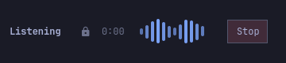
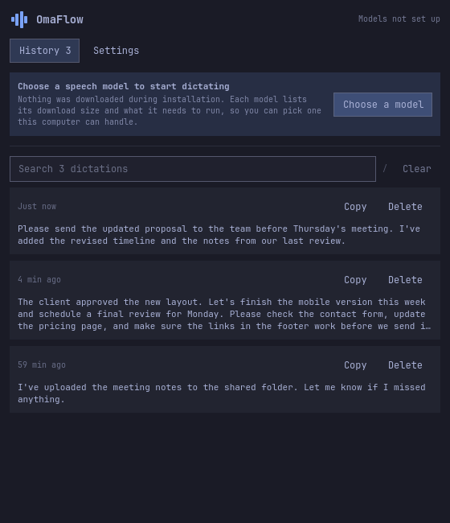
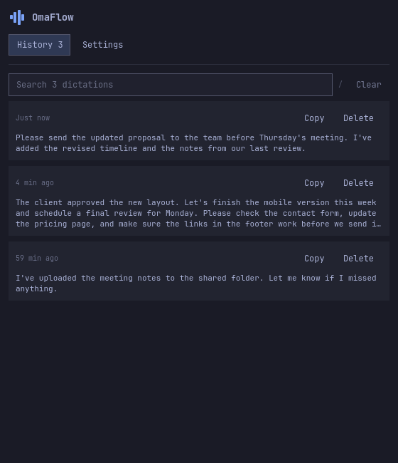
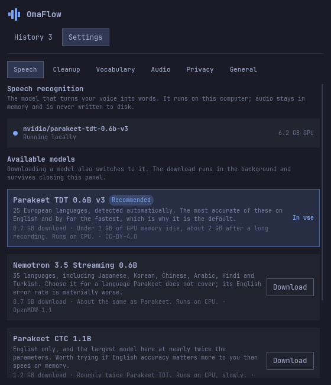
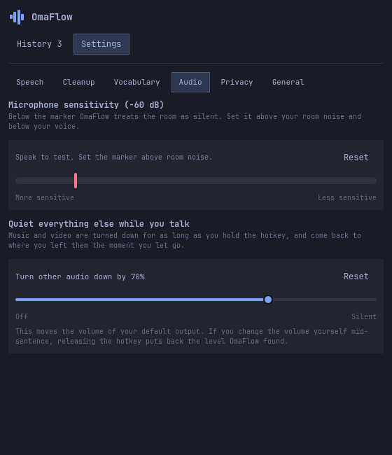

<p align="center">
  
</p>

# OmaFlow

A Wispr Flow alternative for Omarchy. Hold a hotkey, speak, and release to
paste the text into your app. Speech recognition runs on your own machine.

<p align="center">
  
</p>

## Try it

You need Omarchy with its Quickshell bar, Python 3.11+ and a working
microphone.

```bash
omarchy plugin add https://github.com/entroit/omaflow.git
cd ~/.config/omarchy/plugins/entroit.omaflow
./install --hotkey F13
```

Replace `F13` with the key you want to hold. The installer shows its plan and
asks once, then installs the packages it needs, builds the binary, writes the
hotkey and enables the widget. Adding the plugin alone does not install the app.

The install downloads no models. Which speech model to fetch, and whether this
computer can run it, is yours to decide: the panel opens on a card that sends
you to **Settings → Speech**, where each model is listed with its download
size, what it needs to run and its licence. Press **Download** and OmaFlow
pulls the weights and switches to that model; the first one also installs the
speech runtime. The pull runs in the background and survives closing the panel.
If it fails, the card keeps the downloader's last line and offers **Try again**,
and the model you were using stays in place.

Already have a model or a transcription server of your own? That works too.
[Running your own model →](docs/custom-models.md)

<p align="center">
  
</p>

## Speak, then keep typing

| What you want | What to do |
|---|---|
| Dictate a sentence | Hold your hotkey, speak, then release. |
| Talk hands-free | Double-tap to lock. Press again or click **Stop** to finish. |
| Copy without pasting | Choose **Copy only** delivery in Settings → General. |
| Check or correct a result | Open it in History to edit, compare the original, or copy again. |

<p align="center">
  
  <br>
  <sub>Current interface, shown with sample text.</sub>
</p>

## Cleanup is opt-in

By default OmaFlow pastes what the speech model recognized. Turn on
**Natural cleanup** in Settings → Cleanup and a second model removes fillers
and repeated words, applies the corrections you speak out loud, and adds
punctuation and paragraphs, without changing what you said.

Cleanup runs on Ollama, which the installer does not install. The Cleanup tab
hands you the command when it is missing, then lists cleanup models you can
download from the panel. Names and technical terms belong in **Custom vocabulary**,
which applies whether cleanup is on or off.

## Make it yours

- **Models:** Settings → Speech and Settings → Cleanup list models with their
  download size, the hardware they need and their licence. Downloading one
  switches to it. Your own model or server still works, behind **Use your own
  model or server…**
- **Quiet everything else:** while you record, OmaFlow turns your default audio
  output down by 70% and puts the level back when you release. The slider is in
  Settings → Audio.
- **Memory:** turn off **Keep models loaded** to release them after five idle
  minutes. The next dictation takes longer while they load.
- **History:** keep recent dictations or set retention to zero. Training
  logging is off by default. OmaFlow processes microphone audio in memory.
- **One config:** all settings live in `~/.config/omaflow/config.toml`,
  including shortcuts, vocabulary and the cleanup prompt. You or an agent can
  edit it.

<p align="center">
  
  
</p>

Recognition and cleanup can make mistakes, especially with names and numbers.
Long dictations can take several seconds to finish. If cleanup cannot complete,
OmaFlow keeps the recognized text and shows a warning. External model servers
receive the audio or text you send to them.

## Update or remove

Use **Update** in Settings → General when an update is available.

Run `./uninstall` for a clean removal, including settings, history, the
checkout, and models and runtimes installed by OmaFlow.
[Removal details →](docs/configuration.md#removing-omaflow)

## More

[Configuration](docs/configuration.md) · [Running your own model](docs/custom-models.md) ·
[Model benchmarks](docs/why-these-models.md) · [Commands for scripts and agents](docs/commands.md) ·
[Contributing](CONTRIBUTING.md)
