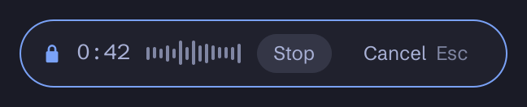
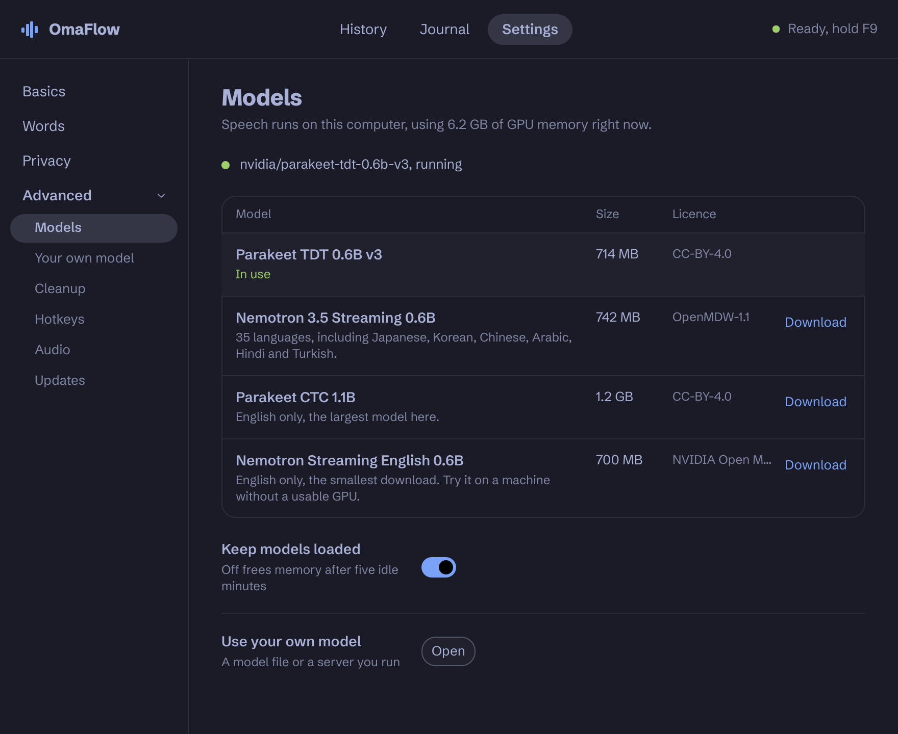
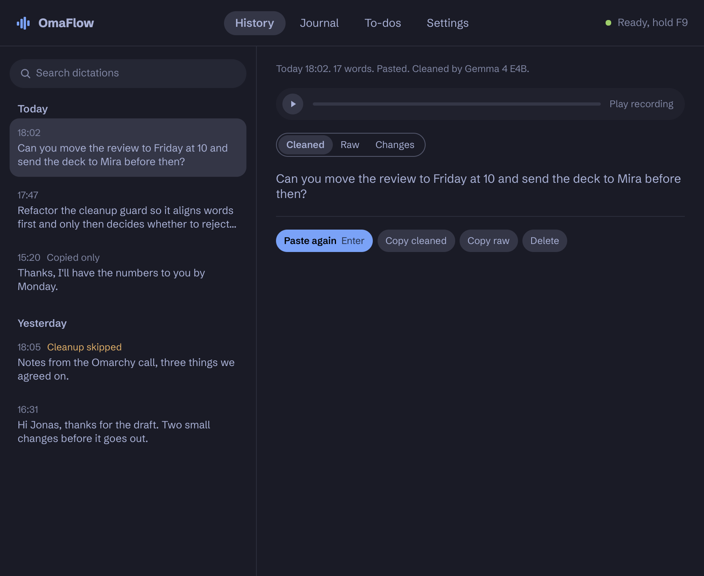
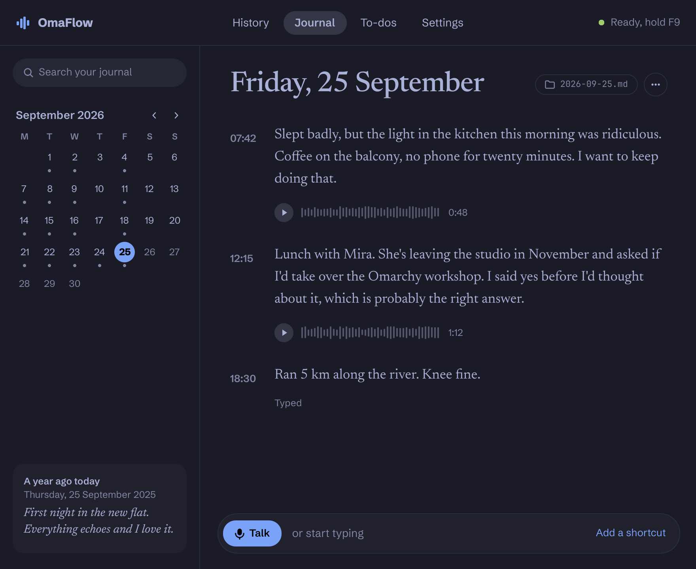

<p align="center">
  
</p>

# OmaFlow

**The free, open-source Wispr Flow for Omarchy.** Hold a key, speak, release.
Your words appear where your cursor is, in any app.

<!-- MEDIA 1: HERO (missing, highest priority)
     10-12s MP4, native GitHub player: cursor in a real app -> hold the key
     (keypress overlay via showmethekey) -> speak -> release -> text lands.
       wl-screenrec -g "$(slurp)" -f raw.mp4
       ffmpeg -i raw.mp4 -vf scale=1280:-2 -c:v libx264 -crf 23 -preset slow \
              -movflags +faststart -an hero.mp4
     Drag hero.mp4 into the README editor on github.com once, paste the
     resulting user-attachments URL here alone on its own line. -->

<p align="center">
  
</p>

Speaking is faster than typing, and the tools that prove it want your voice on
someone else's server. OmaFlow runs on your own machine. A 13.7-second
dictation transcribes in **48.8 ms**, two minutes in **373.6 ms**: 281× and
321× real time, with no network round trip in either.

<!-- MEDIA 2: OFFLINE PROOF (missing)
     4-6s GIF: network switched off, same gesture, still works. Nobody else in
     this category demonstrates it; they only claim it.
       ffmpeg -i raw.mp4 -vf "fps=15,scale=800:-1:flags=lanczos,split[s0][s1];\
              [s0]palettegen=stats_mode=diff[p];[s1][p]paletteuse=dither=bayer" \
              -loop 0 offline.gif -->

## Install

```bash
omarchy plugin add https://github.com/entroit/omaflow.git
cd ~/.config/omarchy/plugins/entroit.omaflow
./install
```

Then click the OmaFlow icon in the bar and choose a speech model; it downloads
there.

Your dictation key is AltGr+Menu. To use another key, choose Change in
Settings → Advanced → Hotkeys and press it.

The marketplace command downloads the plugin. `./install` installs its bundled
binary, user services, and the dictation key. It shows the plan before it
changes your system and does not download a speech model. You do not need Rust
or Cargo.

## Updates stay inside OmaFlow

OmaFlow checks the official Omarchy plugin marketplace once a day. When the
marketplace publishes a verified OmaFlow commit, a desktop notification opens
the OmaFlow window. The bar icon keeps a dot, and **Settings → Advanced →
Updates and app** shows the release summary and changes. Click **Update and restart**
to install it, or **Later** to be reminded tomorrow.

An update waits for an active dictation to finish. OmaFlow then switches the
plugin and daemon together, checks the new service, and restores the previous
release if that check fails, with a notification that says so. It never installs the repository's current branch
or an unreviewed GitHub release.

## Nothing else is downloaded behind your back

No model weights come with the install. **Settings → Advanced → Models** lists every model
with its size, the hardware it needs and its licence. You pick one, and only
then does anything download.

The first speech model also brings the speech runtime. A computer with an
NVIDIA driver gets the CUDA build, which runs on the GPU. Any other computer
gets the CPU build, and the Models page says so. On the CPU of a 6-core
desktop, the default model turns 30 seconds of speech into text in about
2 seconds.

<p align="center">
  
</p>

Your own model or server works too. [Details →](docs/custom-models.md)

## Speak, then keep typing

| What you want | What to do |
|---|---|
| Dictate a sentence | Hold your dictation key, speak, then release. |
| Talk hands-free | Double-tap to lock. Press again or click **Stop**. |
| Stop a hands-free dictation without keeping it | Click **Discard** on the card. |
| Copy without pasting | Choose **Copy only** in Settings → Basics. |
| Use an app-specific paste key | Set it in Settings → Advanced → Hotkeys. |
| Fix a result | Open it in History: see what cleanup changed, fix a word, paste it again. |

<!-- MEDIA 3: WORKS EVERYWHERE (missing)
     6-8s GIF, one continuous take: same gesture in a terminal, a browser field
     and an editor. Proves it is not app-specific. -->

Your music ducks while you talk and comes back when you release. Adjustable in
Settings → Advanced → Audio, down to off.

<p align="center">
  
</p>

## A journal you can talk to

Press **Talk** in the Journal, say what's on your mind, and press **Stop**.
OmaFlow writes it into today's page instead of pasting it, and keeps the
recording so you can hear the entry again. **Discard** throws an entry away.
**Super+Shift+V** opens the OmaFlow window, or closes it; **Esc** and
**Super+W** close it too. Two more shortcuts
have none by default and can be set in Settings → Advanced → Hotkeys: one
starts and saves an entry from any app, the other opens the window on the
journal.

Each day is a plain Markdown file in `~/Documents/Journal`, so any editor or
notes app can read it, and entries you edit there show up in OmaFlow as you
wrote them. The Journal tab adds a calendar, search across every day, what you
wrote a year ago today, and a place to type when talking isn't an option.
Open a day in the future to leave yourself a note: it stays sealed until that
day, then OmaFlow tells you it has arrived. Open a past day to add what you
missed: the entry goes in by its time and says the day you added it.
Recordings live next to the files in a hidden `.recordings` folder, and nothing
leaves the machine. Turning Keep recordings off in the journal settings deletes
them and keeps the words. Choosing another folder there asks whether to move
your days with it; nothing is overwritten.

<p align="center">
  
</p>

## To-dos, said out loud

Hold the to-do shortcut in any app and list what you need to do: "call Mira
about the lease, and move the backups before Friday". OmaFlow adds one task
per thing you named. "Before Friday" becomes a due date, and "Friday at 3pm"
a reminder that arrives on the minute; click it and the to-do waits at the top
of Today under Bubbled up, with **Later** and **Done**. Say "remind me half an hour before",
"remind me at 2:45" or "no reminder" with a to-do to change just its own, or
choose it under the to-do's time: one click for at the time, a little earlier, or off. To be told earlier every time, pick 5 minutes
to an hour before in To-dos → ⋯ → Reminders and folder. The card lists
them and where they went: click one to fix its words, × takes one out, and
**Undo** takes them all back if it split them wrong.
With cleanup on, the cleanup model splits them with a prompt of its own,
which keeps your words and language and puts each task's timing on that task;
without it, each sentence becomes a task. The shortcut works like the dictation key, held or double-tapped, and
has none by default: set it, and one that opens the list, in Settings →
Advanced → Hotkeys.

Lists keep things apart, such as Infra, Dev or Errands: **New list** in the
To-dos sidebar makes one, and hovering a list offers Rename and Delete. Above
them, Today, Upcoming, All and Done look across every list. New to-dos go to
the current list, the one you last added to or picked, and the recording
card names it while you talk. Click the name to send this capture somewhere
else, or click it on the card afterwards to move what was added.

Everything lives in one Markdown checklist, `~/Documents/To-dos/To-dos.md`.
Each list is a `## Heading`, to-dos above the first heading are the Inbox,
and dates are written as `📅 2026-10-02`, which Obsidian's Tasks plugin
reads; a time goes just before it as `⏰ 2026-10-02 15:00`, the Obsidian
Reminder plugin's way. A reminder set on one to-do adds its time first:
`🕒 15:00 ⏰ 2026-10-02 14:30`, or `🕒 15:00` alone for none. Click a to-do's date for this week's days, or **Pick a
date and time…** for any other. Tick a to-do and it moves to Done; **Clear done** takes those out,
with Undo for ten seconds.

The keyboard reaches all of it: **j** and **k** move between to-dos, **[** and
**]** step through the sidebar, **x** or **Space** ticks,
**Enter** or **F2** edits, **D** sets the date, **M** moves it to another list,
**R** sets its reminder, **L** brings a bubbled-up one back later, **Delete** deletes, **N** or **/** starts a new one,
and **Ctrl+Z** undoes.

## Cleanup is opt-in

Off by default, OmaFlow pastes exactly what it heard. **Light** drops fillers
such as "um" and stutters such as "the the" and needs no model. **Medium** adds
a second local model that applies the corrections you speak out loud and
punctuates, keeping every language exactly as spoken. What to change depends on
context, so that is the model's call; OmaFlow only falls back to the raw
transcript when the model's answer is empty or cut off. History shows what
cleanup changed, and Keep the raw text undoes it. Choose the level in
Settings → Basics.

Cleanup uses Ollama by default and also supports OpenAI-compatible chat
servers. Settings → Advanced → Cleanup hands you the Ollama command if it is
missing.

## Yours to configure

Every setting is in `~/.config/omaflow/config.toml`: keys and shortcuts, vocabulary, even
the cleanup prompt. One commented file, no telemetry, editable by you or by an
agent. [Every setting →](docs/configuration.md)

## Remove it

`./uninstall` takes everything back off your machine: settings, history, the
OmaFlow folder, and the models and runtimes OmaFlow installed. It lists all of it
and asks before it erases anything, since none of it comes back. Your journal
and to-dos folders are yours and stay.

## Upgrading from 0.17 or older

OmaFlow 0.17 and older cannot update themselves to this version. After the
marketplace lists 0.18, run the three commands below once, with the exact
40-character commit the marketplace shows. Do not use a branch name such as
`main`.

```bash
git -C ~/.config/omarchy/plugins/entroit.omaflow fetch --no-tags https://github.com/entroit/omaflow <FULL_VERIFIED_COMMIT>
git -C ~/.config/omarchy/plugins/entroit.omaflow merge --ff-only <FULL_VERIFIED_COMMIT>
cd ~/.config/omarchy/plugins/entroit.omaflow && ./install --yes
```

After these three commands, OmaFlow updates itself from the window.

---

MIT licensed. [Contributing](CONTRIBUTING.md)
