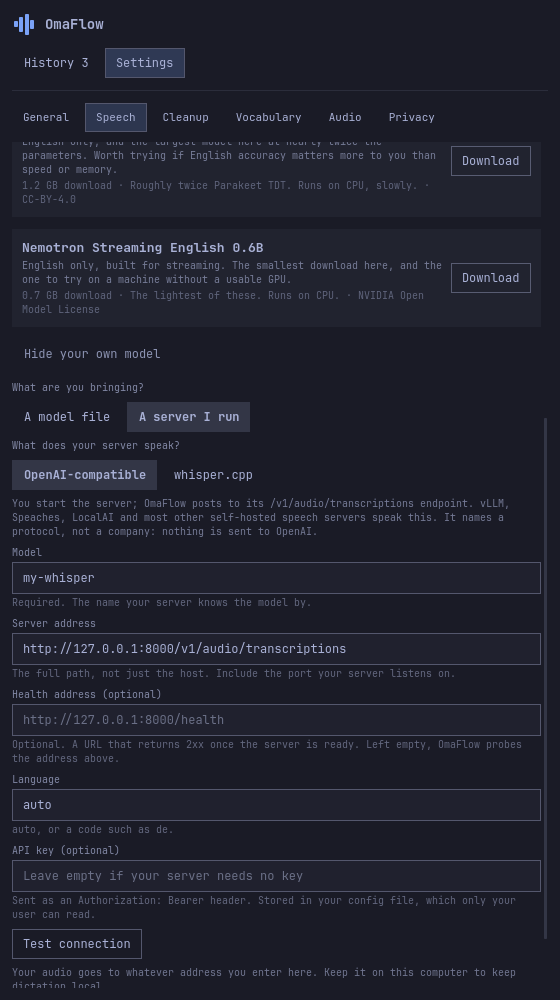

# Running your own model

OmaFlow's catalog is a short list. Anything outside it, a model file you built,
a transcription server you already run, an Ollama tag you pulled yourself, goes
in through the fields behind **Use your own model or server…** in Settings →
Speech and **Use another Ollama model…** in Settings → Cleanup.

`omaflow model-select` only accepts catalog ids and refuses anything else. Set
a custom model through those panel fields or `omaflow configure models`.

## Two questions

The panel asks two questions. This page is organised around the same two.

**What are you bringing?** **A model file** means weights on disk, which OmaFlow
runs the server for. **A server I run** means you start the server and OmaFlow
only sends it requests.

**What does your server speak?**, asked only for your own server:
**OpenAI-compatible** or **whisper.cpp**.

| Your answer | Read |
|---|---|
| A model file: a GGUF file, or a repository in the NeMo cache | [A model file](#a-model-file) |
| A server I run, OpenAI-compatible | [OpenAI-compatible server](#openai-compatible-server) |
| A server I run, whisper.cpp | [whisper.cpp](#whispercpp) |
| Cleanup, which is a separate choice | [Your own cleanup model](#your-own-cleanup-model) |

Stored engine values are unchanged: the first is `nemo`, the others `openai`
and `whisper-cpp`, so any `omaflow configure models` command keeps working.

Every field below is a personal setting. It applies to the next dictation
without rebuilding OmaFlow, so finish or discard an active recording first. A
replacement model needs its own accuracy and hardware evaluation; a reachable
server is not an accurate one.

Some limits apply everywhere. Endpoints must be `http://` or `https://` URLs,
at most 2048 characters, with no whitespace. A model name or path is at most
512 characters and may not begin with `-`, though whisper.cpp may leave it
empty because it never sends one. The language is `auto` or a code of ASCII
letters and hyphens, at most 32 characters.

### If your server needs a key

Both tabs have an **API key (optional)** field. A key set there goes out as an
`Authorization: Bearer` header, and only when you have set one. A model file needs no key,
because nothing leaves the machine, so the field is hidden there; the bundled NeMo server
does accept `--api-key` if you have reasons of your own to use it.

The key is handled as a secret rather than as another setting. It lives in your
config file, which only your user can read, and it is the one value the daemon
never publishes: the panel and `omaflow effective-config` see a
`speech_api_key_set` or `cleanup_api_key_set` boolean and nothing more. It
reaches curl through an owner-only file that is deleted after the request,
never as an argument, where anyone reading `/proc` would find it. A key must be
one line without quotes, at most 4096 characters, so it cannot smuggle a second
header in.

The field is write-only. Leaving it empty on save keeps the key you already
stored; typing replaces it; **Remove the stored key** clears it.

## A model file

You provide the weights. OmaFlow runs the server: it starts and restarts
`omaflow-asr.service` with the model and device you chose, and stops it again
when `keep_models_loaded` is off.

Give `speech_model` either an absolute path to a GGUF file, or a repository
name whose weights are already unpacked under `~/.cache/nemo-speech/models/`.
Startup resolves an existing file and never passes a repository name that could
make NeMo download something on its own, so if the cache holds several
revisions of one repository, give the absolute path instead. A missing or
ambiguous file reports a setup error rather than restarting the service in a
loop. `~/.local/lib/nemo-speech/bin/nemo-speech model list` prints what the
installed runtime accepts.

The endpoint has to be loopback, `http://127.0.0.1:PORT/...` or
`http://localhost:PORT/...`, and it has to contain `/v1/`. OmaFlow takes the
port from it and binds the server there, and derives the health probe by
splitting at `/v1/` and asking for `/health` on what precedes it, so keep the
`/v1/audio/transcriptions` shape. An endpoint without `/v1/` is refused when you
save it rather than saving and then never reporting ready. A health address is
refused here too: this engine has its own, and a URL left over from another
server would otherwise decide whether NeMo is running.

`speech_device` accepts `auto`, `cpu`, `cuda`, `vulkan` or `metal`. It selects
a mode in the runtime you have installed; it does not fetch a different build.

In the panel: answer **A model file**, then fill **Model**, **Server
address**, **Language** and **Device**. There is no **Health address**, **API
key** or **Test connection** here: the first two do not apply, and the server is
not running yet while you are configuring it, so there would be nothing to ask.

```bash
omaflow configure models '{"speech_engine":"nemo","speech_model":"/home/you/models/my-asr-q8_0.gguf","speech_endpoint":"http://127.0.0.1:18103/v1/audio/transcriptions","speech_device":"cuda","speech_language":"auto"}'
```

## OpenAI-compatible server

<p align="center">
  
</p>

You run the server. OmaFlow only sends requests to it and never starts, stops
or repairs it. This is the shape vLLM, Speaches, LocalAI and most other
self-hosted speech servers implement. It names a protocol, not a company:
nothing is sent to OpenAI, and there is no account involved.

Use `speech_engine` `openai` and the server's full transcription endpoint,
usually `/v1/audio/transcriptions`. OmaFlow posts a multipart form with the
recording as `file` (16 kHz mono WAV named `dictation.wav`, type `audio/wav`),
`response_format=json`, and `model` set to your `speech_model`. With the
language on `auto` it omits the `language` field and lets the server decide; an
explicit code is sent. The reply must be a JSON object with a `text` string.

In the panel: answer **A server I run** and **OpenAI-compatible**, then fill
**Model**, **Server address**, **Health address (optional)** and **Language**,
plus **API key (optional)** if your server wants one.

```bash
omaflow configure models '{"speech_engine":"openai","speech_model":"YOUR_SERVER_MODEL","speech_endpoint":"http://127.0.0.1:8000/v1/audio/transcriptions","speech_health_endpoint":"","speech_language":"auto"}'
```

## whisper.cpp

You run whisper-server, and it decides which model it holds. Point
`speech_endpoint` at its `/inference` URL.

This adapter sends no `model` field, so `speech_model` is a label for your own
benefit and may be left empty; renaming it loads nothing inside the server. Set
the real model with whisper-server's own `--model` option before you start it.
The `language` field is always sent for this engine, including the value
`auto`, so leave Language on `auto` unless you want a fixed language.

The health address is optional here. whisper-server registers `/inference` for
POST only, so a GET on it answers 404 and OmaFlow's probe counts only 2xx and
405 as reachable. Rather than leave a correct setup reporting **Stopped**,
OmaFlow probes `/health` on the same origin when the field is empty. Fill it in
only to override that.

In the panel: answer **A server I run** and **whisper.cpp**, then fill **Server
address**, and **API key (optional)** if your server wants one.

Use whatever address you started whisper-server on:

```bash
omaflow configure models '{"speech_engine":"whisper-cpp","speech_endpoint":"http://127.0.0.1:8080/inference","speech_language":"auto"}'
```

## Your own cleanup model

Cleanup supports Ollama's `/api/chat` protocol and the OpenAI-compatible
`/v1/chat/completions` protocol used by gateways, vLLM and LM Studio. Choose
the protocol in Settings → Cleanup. The configured address must end in the
matching path.

Any Ollama tag you have pulled yourself works, whether or not it is in the
catalog. `ollama list` shows what your server holds; `ollama pull TAG` adds
one. A bare GGUF has to be imported into Ollama first, with Ollama's own tools.

OmaFlow posts a system message holding the cleanup prompt and a user message
holding your transcript, with streaming disabled. Pointing the endpoint at
another machine means the transcript and focused window information leave
this computer. Clipboard context also leaves when you enable it. Use a server
you trust. A local gateway may forward the request according to its own
configuration.

When an Ollama model name or endpoint changes, OmaFlow asks the previous model
to unload so it stops holding memory. OmaFlow does not manage the lifecycle of
an OpenAI-compatible server.

```bash
ollama pull qwen3:8b
omaflow configure models '{"cleanup_model":"qwen3:8b","cleanup_endpoint":"http://127.0.0.1:11434/api/chat"}'

omaflow configure models '{"cleanup_engine":"openai","cleanup_model":"my-model","cleanup_endpoint":"http://127.0.0.1:4000/v1/chat/completions"}'
```

Speech and cleanup requests make up to three attempts within the configured
overall timeout. OmaFlow retries connection failures, timeouts, rate limits
and temporary server errors. It does not retry authentication or other client
errors. Every attempt receives the same audio or cleanup request. A server may
have processed a request before the connection failed, so a retry can repeat
one inference and its provider cost.
The first request keeps its full remaining deadline. A server's `Retry-After`
delay is respected in seconds or HTTP-date form. If that delay uses up the
deadline, OmaFlow stops without another request. OpenAI-compatible cleanup
servers receive no automatic warm-up or unload requests.
Application HTTP requests ignore personal curl configuration files so those
files cannot add retries or redirects. Put endpoint and credential settings in
OmaFlow's configuration rather than `.curlrc`.

Cleanup quality is not something a connection check can tell you. The gates in
[CONTRIBUTING](../CONTRIBUTING.md#model-gates) score the guarded output,
including the raw fallbacks, for any model or prompt.

## Did it work

The status card at the top of Settings → Speech is the answer for speech. It
shows the model name with a filled dot and **Running locally** when OmaFlow
runs the server, or **Server is reachable** when you do. **Stopped** means the
health probe failed. **Not set up yet** means `models_configured` is still
false; the **Enable dictation with this model** button under the fields sets
it, and appears only while it is false.

The probe is one HTTP request with a one-second timeout. With a health endpoint
set, only a 2xx counts. Without one, OmaFlow probes an external server's
transcription URL and accepts 2xx or 405, since a transcription endpoint often
rejects a bare GET. For whisper.cpp and for the server OmaFlow runs, it derives
`/health` instead. Reachable is not the same as loaded, and never the same as
accurate.

Cleanup has no status card. Settings → Cleanup warns when the configured
server is not answering. It offers the install command only for Ollama on a
local address when `ollama` is missing. An OpenAI-compatible server remains
under the control of the person who configured it.

Every field checks itself as you type. A bad one turns red and says why, and
**Save** stays disabled until they are all valid, so the panel refuses what the
daemon would have refused anyway. The daemon validates again on save, and
nothing is written unless the whole configuration passes.

### Test it from the panel

**Test connection** on the Speech tab sends one unauthenticated GET and tells you what came back. On the Speech
tab it appears once you answer **A server I run**, and asks the health address if
you filled one in, otherwise the URL the daemon's own probe would use: the
server address, or `/health` on the same origin for whisper.cpp.

| Result | Means |
|---|---|
| 2xx | Something is listening. Ollama's root and the NeMo server's `/health` both answer 200. |
| 405 | A POST-only endpoint answering correctly. `/api/chat` returns this. Fine. |
| 401 or 403 | The server is reachable but access was denied. This button does not test credentials. |
| 404 | Fix this. A path that only takes POST often answers 404 to a GET, and OmaFlow reads 404 as offline, so fill in a health address if your server has one. Measured here: the NeMo server's `/v1/audio/transcriptions` answers 404 to a GET while its `/health` answers 200. Otherwise the path is wrong. |
| Anything else | The server answered, but not with something that means ready. |
| No answer | curl's own error, printed as it came. |

A passing test says the address is real. It says nothing about which model is
loaded behind it.

On the Cleanup tab, **Test saved cleanup model** sends one authenticated POST
using the saved protocol, endpoint, model and API key. Save edits before testing;
unsaved fields are not used. It sends a short synthetic prompt, never your
dictation, custom prompt, vocabulary, window title or clipboard. The provider
may charge for this request. The test does not retry.

The result distinguishes denied credentials, unavailable models when the server
identifies them, endpoint/request errors, rate limits and invalid replies. A
successful test means the saved model returned text, not that its cleanup
quality is good. You can run the same test with `omaflow test-cleanup`.
Credentials use a private temporary curl configuration, never process arguments;
if private credential storage fails, the request is not sent.

A failure at dictation time appears on the recording result instead: a request
that fails, a reply that is not JSON, a reply with no `text`, or an empty
transcript. If cleanup is the part that fails, OmaFlow keeps the recognized
text and shows a warning rather than losing your dictation.

`omaflow effective-config` prints the merged configuration the daemon is
actually using, which is the fastest way to see what your last save did.

## The keys

`omaflow configure models JSON` takes partial updates, so send only what
changes.

| Key | Panel field |
|---|---|
| `speech_engine` | The two question rows: `nemo`, `openai` or `whisper-cpp` |
| `speech_model` | Model |
| `speech_endpoint` | Server address |
| `speech_health_endpoint` | Health address (optional), your own server only |
| `speech_language` | Language |
| `speech_device` | Device, OmaFlow-runs-it only |
| `speech_api_key` | API key (optional), your own server only |
| `cleanup_engine` | `ollama` or `openai` |
| `cleanup_model` | Cleanup model name or Ollama tag |
| `cleanup_endpoint` | Cleanup server address |
| `cleanup_api_key` | API key (optional) |

The remaining cleanup options, and the prompt itself, are under `[cleanup]` in
`~/.config/omaflow/config.toml`. See the
[configuration map](configuration.md).

Protocol references: [Ollama chat API](https://docs.ollama.com/api/chat),
[OpenAI chat completions](https://platform.openai.com/docs/api-reference/chat)
and [whisper.cpp server](https://github.com/ggml-org/whisper.cpp/blob/master/examples/server/README.md).
